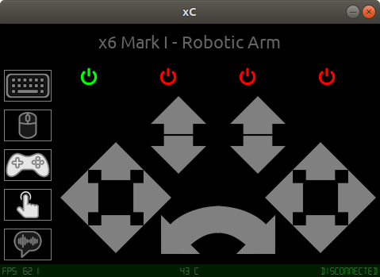
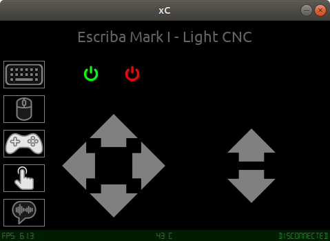
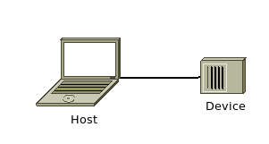

# xc - aXes Controller

## Introduction
xc is a software to rule robots.

### Screenshots




## Changes
All notable changes to this project will be documented in this [Change log](CHANGELOG.md).

## Topology


## Terminology
- xc: this software;
- Host: The computer system running xc software;
- Device: The device that will be controlled by xc, such as a robot, CNC, 3D Printer, and much more;
- User: It's you!

## Requirements
For installing and running, you will need Ansible (>= 2.7), Python (>=3.6) and PIP (>= 1.5).

## Installation

### Cloning
``` bash
git clone --recurse-submodules https://github.com/marcio-pessoa/xc.git
```
### Install
Change to work directory and run Ansible Playbook:
``` bash
cd xc
ansible-playbook xc.yaml
```

Running:
``` bash
xc
```

For help:
``` bash
xc -h
```

## Configuration file

### Macros
I recommend you use underline before macro name. It's usefull to quickly identify a macro.

### Keyboard map

To configure controls, take a look at [controls.md](Documents/controls.md).

---
