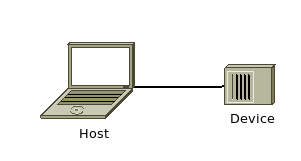

# xC - aXes Controller

## Introduction
xC is a software to rule all robots.


<!--
## Videos
Watch this projects videos on [YouTube Playlist].
-->

## Changes
All notable changes to this project will be documented in this [Change log](CHANGELOG.md).

## Topology


## Terminology 
- xC: aXes Controller, this software
- Host: The computer system running xC software
- Device: The device that will be controlled by xC, such as a robot, CNC, 3D Printer, and much more.
- User: It's you!

## Installation

Download xC lastest version:
``` bash
wget https://git.sciemon.com/sciemon/xc/archive/0.50b.zip
```
Uncompress:
``` bash
unzip xc.zip
```
Run installer:
``` bash
sudo ./setup install
```
## Configuration file

### Macros
I recommend you use underline before macro name. It's usefull to quickly identify a macro.

### Keyboard map

To configure controls, take a look at [controls.md](Documents/controls.md).
